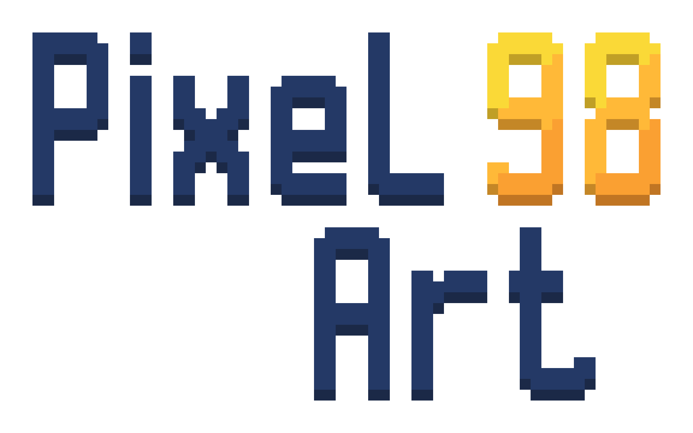

# PixelArt98

[](https://github.com/LordVinzz/PixelArt98/actions/workflows/release.yml?query=branch%3Amain+event%3Apush)
[](https://github.com/LordVinzz/PixelArt98/actions/workflows/release.yml?query=branch%3Amain+event%3Apush)
[](https://github.com/LordVinzz/PixelArt98/actions/workflows/release.yml?query=branch%3Amain+event%3Apush)
[](https://github.com/LordVinzz/PixelArt98/actions/workflows/release.yml?query=branch%3Amain+event%3Apush)
[](https://github.com/LordVinzz/PixelArt98/actions/workflows/release.yml?query=branch%3Amain+event%3Apush)
[](https://github.com/LordVinzz/PixelArt98/actions/workflows/release.yml?query=branch%3Amain+event%3Apush)



[README](README.md) | [License](LICENSE) | [Animation](docs/ANIMATION.md) | [Comparisons](docs/COMPARISONS.md) | [Our Philosophy](docs/OUR_PHILOSOPHY.md)

PixelArt98 is a native C++23 pixel-art editor inspired by classic desktop paint tools. It focuses on direct pixel editing, animation frames, layered compositing, and Minecraft-style cuboid texture workflows in one small OpenGL application.

The badges above track the main deployment workflow. Each platform job builds the application and runs the complete test suite, including import/export roundtrip tests.

The app is built as a portable desktop executable for Windows, macOS, and Linux. Release builds embed the splash artwork and application assets into the binary, so the distributed ZIP packages contain a runnable executable plus documentation rather than a loose resource tree.

## Features

- New document dialog for starting custom canvases without editing a project file by hand.
- Pixel canvas with pencil, brush, eraser, line, rectangle, ellipse, fill, gradient, clone stamp, text, selection, lasso, and magic wand tools.
- Live pixel previews while dragging shape and selection tools.
- Ctrl-constrained drawing for 1:1 rectangles/ellipses and 45-degree line snapping.
- Layers with opacity and Paint.NET-style blend modes.
- Adjustment previews for tonal range, editable RGB curves, histogram-aware edits, and common image filters.
- Undoable rotate/zoom and straighten transform previews with workspace and history controls.
- Animation frames, durations, playback, onion-skin preview, spritesheet export, GIF export, and APNG export.
- Native `.pixart` project files.
- Minecraft/block-model texture editing with cuboids, UV overlays, wireframes, transparent-face hints, and 3D preview.
- GPU-accelerated effect previews and heavy-image processing through OpenGL, with capability-based chunking and optional Metal/MPS acceleration on macOS.
- Optional depth-map layer generation from an existing layer using real depth models through ONNX Runtime or OpenCV DNN when those backends are configured.
- Pixel-perfect startup splash screen that can be disabled from `Options > Show Splash Screen`.

## Download

Tagged releases are built by GitHub Actions and publish:

- `PixelArt98-windows-x64.zip`
- `PixelArt98-macos-universal.zip`
- `PixelArt98-linux-x64.zip`
- `PixelArt98-source-<tag>.zip`

Each platform ZIP contains the embedded executable and this README. Linux still requires the usual desktop OpenGL/window-system runtime libraries supplied by the distribution.

## Build Locally

Requirements:

- CMake 3.24 or newer
- A C++23 compiler: Clang, GCC, or MSVC
- Git
- Platform OpenGL development libraries

Optional depth-map extraction support:

- ONNX Runtime SDK, discoverable with `ONNXRUNTIME_ROOT` or standard include/library paths
- OpenCV with `core`, `dnn`, and `imgproc`, enabled with `-DPIXELART_ENABLE_OPENCV_DNN=ON`
- `curl` for first-run model downloads when model files are not already cached

Configure, build, and test:

```sh
cmake -S . -B build -DPIXELART_BUILD_BOTH=ON -DPIXELART_BUILD_TESTS=ON
cmake --build build
ctest --test-dir build --output-on-failure
```

The root Makefile wraps the same regular workflow:

```sh
make all
make test
```

`make all` configures, builds, and runs the full regular test pass. `make test` builds first, then runs the same tests.

Run either launcher:

```sh
./build/pixelart_sdl2
./build/pixelart_glfw
```

On Windows, use the executable path produced under the selected CMake configuration directory, for example `build/Release/pixelart_sdl2.exe` when using a multi-config generator.

## Release Workflow

The deployment workflow is in `.github/workflows/release.yml`.

- Pushes and pull requests build and test Windows, macOS, and Linux.
- Workflow artifacts include zipped executables for each platform and a zipped source archive.
- Pushing a tag matching `v*` creates or updates a GitHub Release and uploads the ZIP assets.

Example release:

```sh
git tag v0.1.0
git push origin v0.1.0
```

## Development Notes

The project uses CMake `FetchContent` for pinned third-party dependencies: SDL2, GLFW, Dear ImGui docking, stb, miniz, gifenc, nlohmann/json, GLAD, and nativefiledialog-extended.

The codebase targets C++23 with warnings treated as errors for Clang, GCC, and MSVC. Debug builds on Clang/GCC enable address and undefined-behavior sanitizers.

## License

This project is source-available for non-commercial use only.

You may read, use, copy, modify, and redistribute this software for free non-commercial purposes only. Commercial use, paid redistribution, paid bundling, SaaS use, marketplace distribution, paid integration, paid support, paid consulting, or inclusion in a paid pack or paid product requires prior written permission from DOMINGUEZ Vincent.

Commercial licensing requests: vincent.dominguez@master-developpement-logiciel.fr

See [`LICENSE`](./LICENSE) and [`THIRD-PARTY-NOTICES.md`](./THIRD-PARTY-NOTICES.md).
